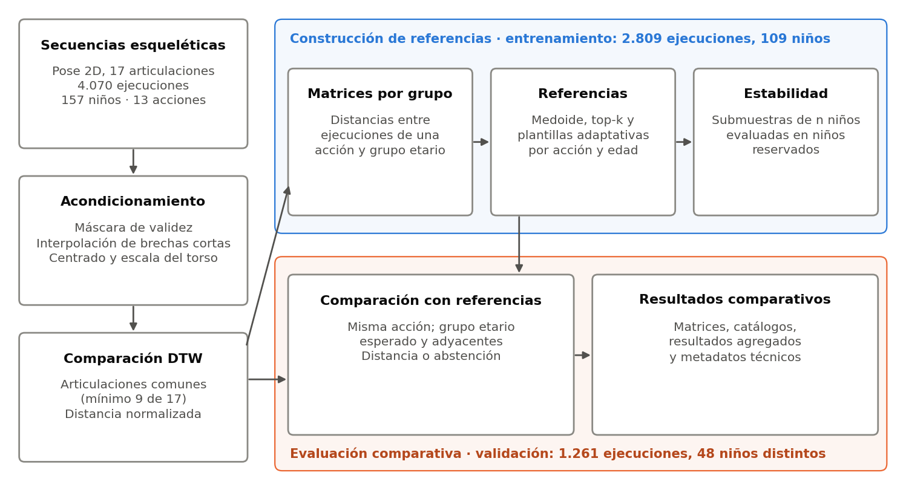

# DIANA · Análisis comparativo de habilidades motrices

Código y documentación que respaldan el **Informe Técnico N.° 1** del servicio
especializado en implementación de modelos de inteligencia artificial del
proyecto DIANA (Orden de Servicio N.° 000921, actividad A1: *algoritmo
optimizado de análisis comparativo de habilidades motrices*).

El repositorio contiene solo lo necesario para reproducir y auditar los
resultados del informe: el algoritmo de comparación, la selección de
referencias, el estudio de estabilidad, la comparación con referencias, las
figuras, un visor de alineamiento y un verificador de cifras. No contiene datos
de participantes (ver [PRIVACIDAD.md](PRIVACIDAD.md)).



## Qué hace

1. **Acondiciona** las secuencias esqueléticas 2D (17 articulaciones COCO):
   máscara de validez (confianza ≥ 0,30), interpolación de brechas de hasta 3
   fotogramas, centrado en las caderas y escala del torso.
2. **Compara** ejecuciones de una misma acción mediante Dynamic Time Warping
   (DTW) calculado sobre las articulaciones válidas en ambos fotogramas, con un
   mínimo de 9 de 17. Si no existe un alineamiento con ese soporte, la
   comparación se registra como abstención.
3. **Selecciona referencias** por acción y grupo etario con el conjunto de
   entrenamiento: referencia primaria (medoide), conjunto top-k de niños
   distintos y plantillas adaptativas (p-medianas).
4. **Evalúa la estabilidad** de las plantillas al variar el número de niños:
   resultado, asignaciones y variabilidad del conjunto.
5. **Compara** cada ejecución de validación con las referencias de su acción en
   su grupo etario y en los adyacentes, y organiza matrices, catálogos,
   resultados agregados y metadatos.

## Estructura

```
configuracion/
  rutas.ejemplo.json        ubicación de los datos locales (copiar como rutas.json)
  estabilidad.json          parámetros y huellas de insumos del estudio de estabilidad
diana_comparativo/          paquete con el algoritmo
  acondicionamiento.py      Sección 2.3: validez, interpolación, centrado y escala
  dtw.py                    Sección 2.4: costo local, soporte mínimo y DTW
  referencias.py            Sección 2.5: matrices por grupo, primaria y top-k
  estabilidad.py            Secciones 2.5 y 2.6: plantillas adaptativas y soporte muestral
  comparacion.py            Sección 3.4: comparaciones previstas, distancias y abstenciones
  perfiles.py               Sección 3.4: resultados agregados por ejecución y por niño-acción
  rutas.py                  lectura de configuracion/rutas.json
scripts/
  01_acondicionar_secuencias.py
  02_matrices_por_grupo.py
  03_seleccionar_referencias.py
  04_estudio_estabilidad.py
  05_comparar_con_referencias.py
  06_generar_figuras.py     Figuras 1 a 5 del informe
  07_verificar_cifras.py    contrasta las salidas con las cifras del informe
  visor_alineamiento.py     visor HTML de una comparación (o demostración sintética)
  resumen_revision_visual.py  estado de la revisión visual de referencias
tests/                      pruebas automatizadas con datos sintéticos
docs/
  correspondencia_con_el_informe.md   tabla o figura → script → archivo de salida
  datos_requeridos.md                 formato de los insumos
  figuras/                            figuras del informe (solo datos agregados)
```

## Instalación

Requiere Python 3.10 o superior. Versiones probadas: NumPy 1.26, pandas 2.3,
SciPy 1.15, scikit-learn 1.7, pyarrow 25, Numba 0.65.

```bash
python -m venv .venv
source .venv/bin/activate
pip install -r requirements.txt
```

Numba es opcional; sin él el cálculo DTW es correcto pero más lento.

## Configuración de los datos

Los datos se encuentran en el almacenamiento local autorizado del proyecto.
Copie el archivo de ejemplo e indique sus rutas:

```bash
cp configuracion/rutas.ejemplo.json configuracion/rutas.json
```

`datos_raiz` es la carpeta de datos; las demás rutas son relativas a ella.
`salida` debe estar **fuera** del repositorio. El formato de cada insumo se
describe en [docs/datos_requeridos.md](docs/datos_requeridos.md).

## Ejecución

Los pasos siguen el orden del informe. Cada script admite `--help`.

| Paso | Comando | Tiempo aprox. |
| --- | --- | --- |
| 1. Acondicionar secuencias | `python scripts/01_acondicionar_secuencias.py` | 20 s |
| 2. Matrices por grupo (método actual) | `python scripts/02_matrices_por_grupo.py --procesos 8` | 1 min |
| 3. Seleccionar referencias | `python scripts/03_seleccionar_referencias.py --comparar-con-catalogo` | 10 s |
| 4. Estudio de estabilidad | `python scripts/04_estudio_estabilidad.py --procesos 4` | 36 min |
| 5. Comparar con referencias | `python scripts/05_comparar_con_referencias.py --procesos 4` | 25 s |
| 6. Figuras del informe | `python scripts/06_generar_figuras.py` | 10 s |
| 7. Verificar cifras | `python scripts/07_verificar_cifras.py` | 5 s |

Herramientas de inspección:

```bash
python scripts/visor_alineamiento.py --demo --archivo visor_demo.html      # sin datos reales
python scripts/visor_alineamiento.py --caso <segment_id> --referencia <segment_id>
python scripts/resumen_revision_visual.py
```

El visor genera un HTML autocontenido con los dos esqueletos recorriendo el
camino de alineamiento, la matriz de costos y el costo por paso. Con datos
reales se guarda en la carpeta de salida, porque contiene coordenadas de pose.

## Reproducibilidad y verificación

- **Referencias.** Las referencias del informe se seleccionaron con las
  matrices de distancias de la selección inicial (`matrices_historicas`),
  calculadas antes de adecuar el tratamiento de faltantes. El paso 3 aplicado a
  esas matrices reproduce exactamente el catálogo del informe (52 primarias y
  194 top-k). El paso 2 calcula las matrices con el método actual; las
  referencias obtenidas a partir de ellas pueden diferir.
- **Estudio de estabilidad.** Usa las mismas matrices de la selección inicial.
  Antes de ejecutar comprueba conteos y huellas SHA-256 de todos los insumos.
  La semilla y el número de repeticiones fijan el resultado.
- **Comparación con referencias.** Usa el núcleo DTW actual sobre las
  secuencias acondicionadas y las referencias congeladas.
- **Verificación.** `07_verificar_cifras.py` contrasta las salidas con las
  cifras de las Tablas 2 a 7 y de las Secciones 2.3, 3.2, 3.4 y 4.3, e indica
  la ubicación de cada una en el informe.

Las distancias describen similitud geométrica y temporal con referencias
concretas. No constituyen una puntuación TGMD-3 ni un juicio sobre el
desempeño motor.

## Pruebas

```bash
python -m pytest
```

Las pruebas usan datos sintéticos y verifican el núcleo DTW, el
acondicionamiento, la selección de referencias, el optimizador de plantillas,
las métricas de estabilidad, la comparación con abstenciones y el visor.
